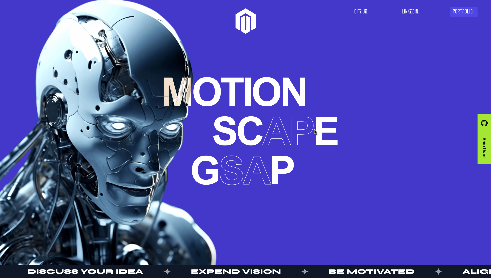

# Motion Scape

A simple, clean project built with [Next.js](https://nextjs.org/) and [GSAP](https://greensock.com/gsap/) to explore smooth animations and transitions for modern web applications.



## 🚀 Features

- **Next.js**: Server-rendered React framework for optimized performance.
- **GSAP**: Robust animation library for smooth, high-performance animations.
- **Simple Animations**: Lightweight, clean animations focused on user experience.

## 🚀 Tech Stack

**Tool:** [NextJS](https://remix.run/)

**Type Checking:** [TypeScript](https://www.typescriptlang.org/)

**Linting/Formatting:** [Eslint](https://eslint.org/) & [Prettier](https://prettier.io/)

**Icons:** [Tabler Icons](https://tabler.io/icons) & [Iconsax](https://iconsax-react.pages.dev/)

## Run Locally

Clone the project

```bash
  git clone https://github.com/devshinthant/motion-scape.git
```

Go to the project directory

```bash
  cd motion-scape
```

Install dependencies

```bash
  pnpm install
```

Start the server

```bash
  pnpm start
```

## Author

Made with ❤️ by [@shinthant](https://github.com/devshinthant)

## License

Licensed under the [MIT License](https://choosealicense.com/licenses/mit/)
